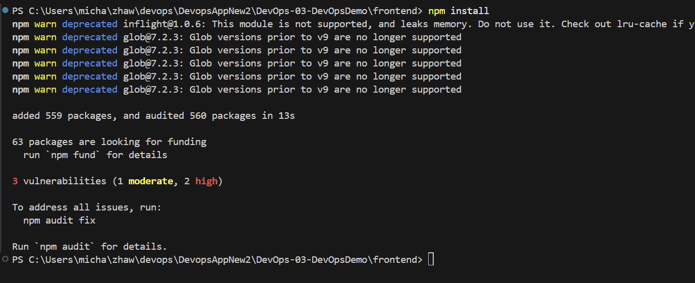
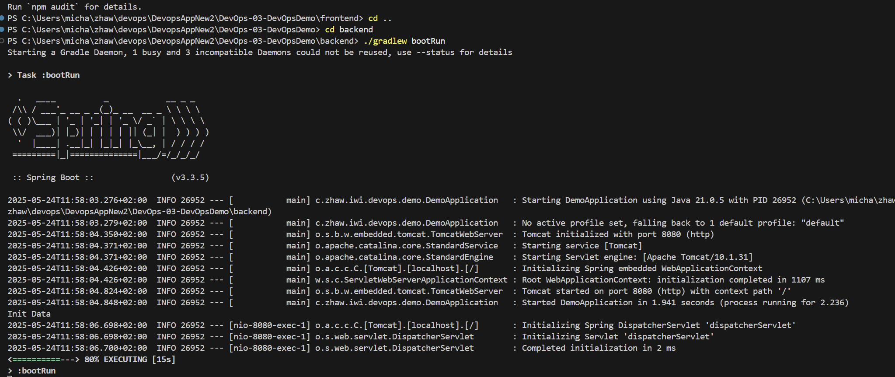
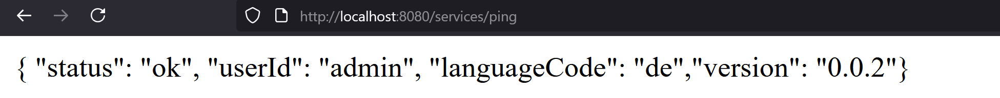
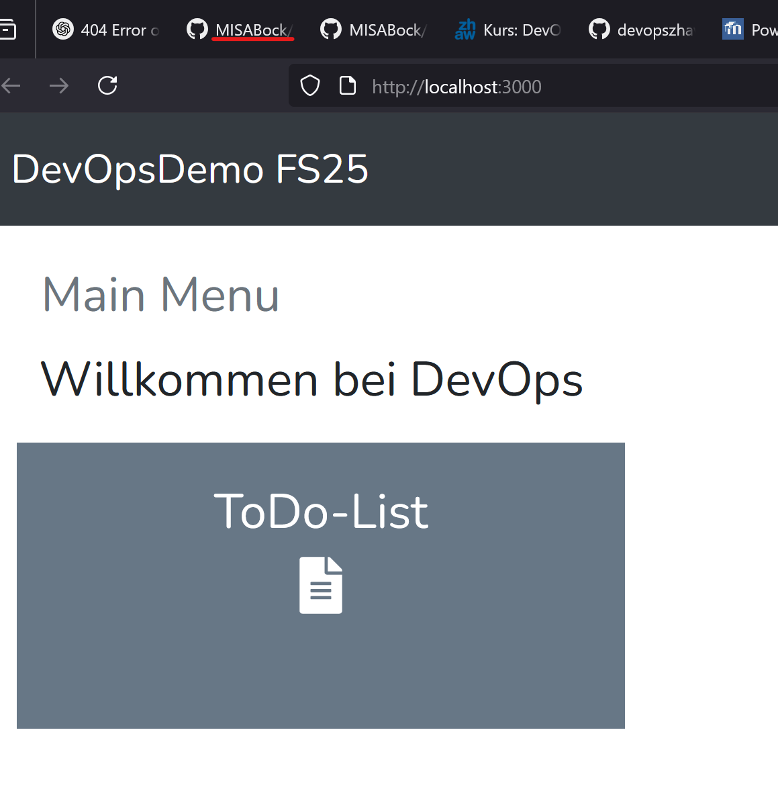
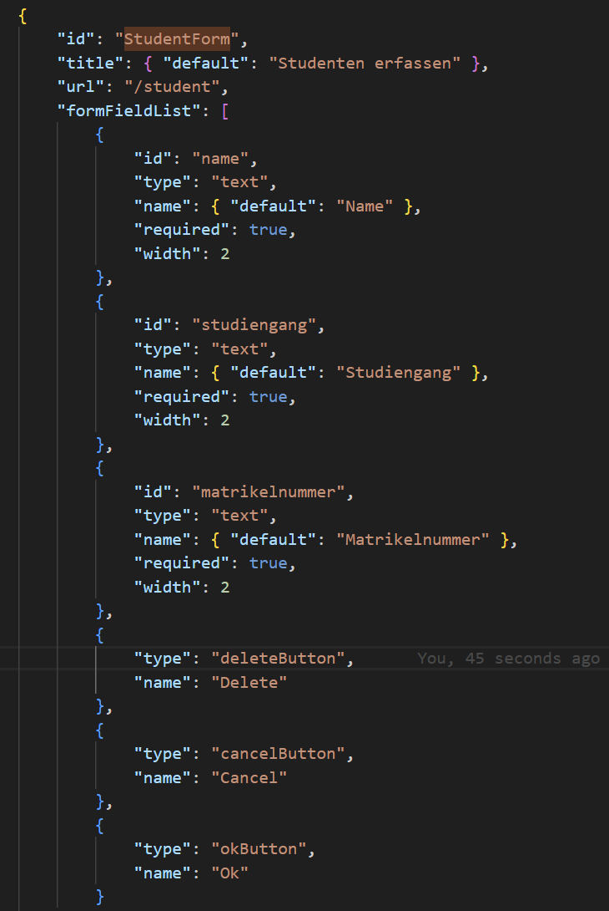
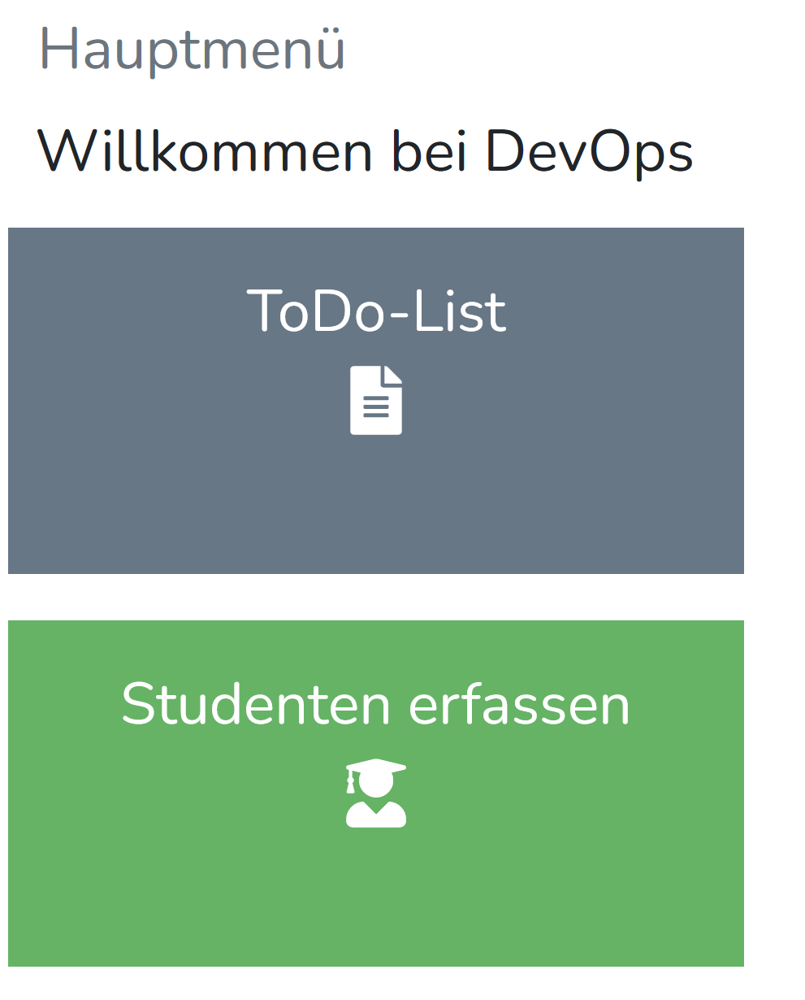
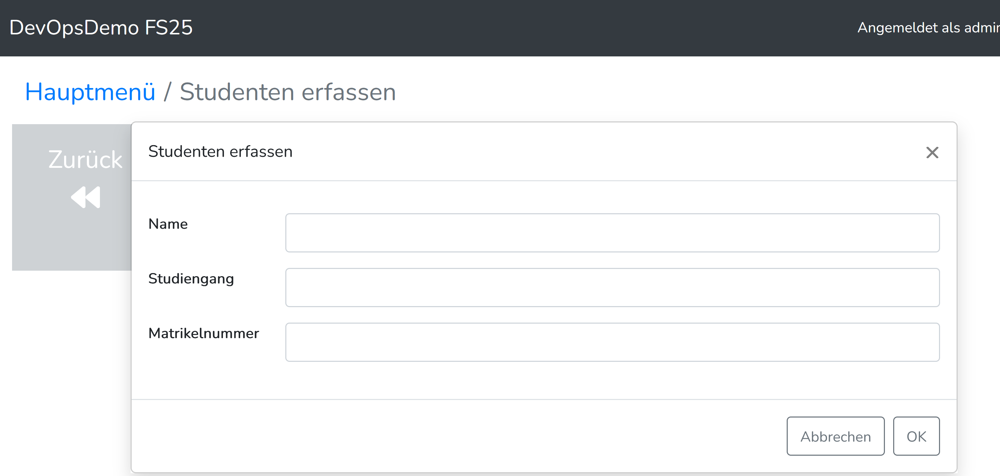

# DevOps 03 DevOpsDemo

als erstes Habe ich die Repo gecloned die Workspace Definition geöffnet, im Fornt ein "npm install"

als nächstes habe ich das backend gestaret

frontend3000
so sieht nun das Frontend aus

Ich habe nun das Frontend noch angepasst. und zwar hier mit einer neuen Form bei der man einen neuen Studenten erfassen kann. Zusätzlich noch die neue Seite und den Button im mainMenu

