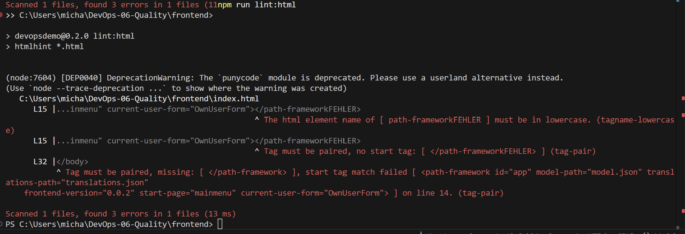
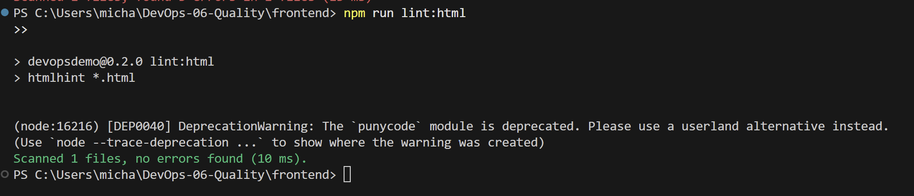
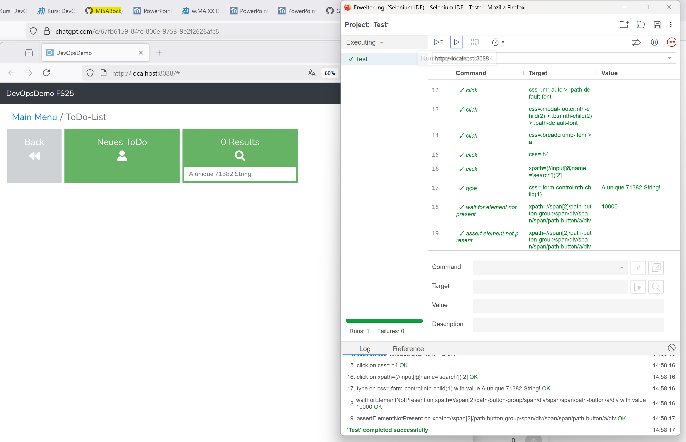
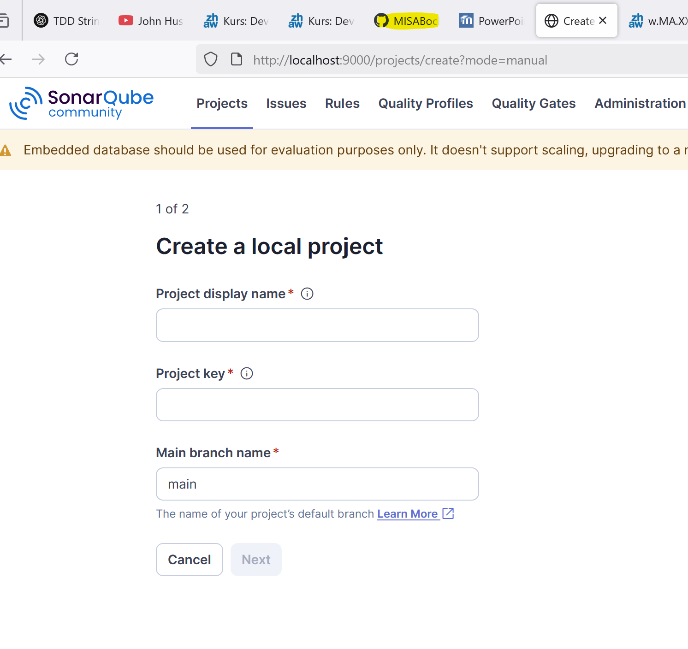
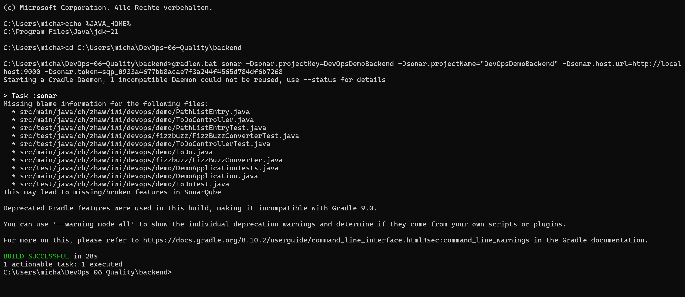
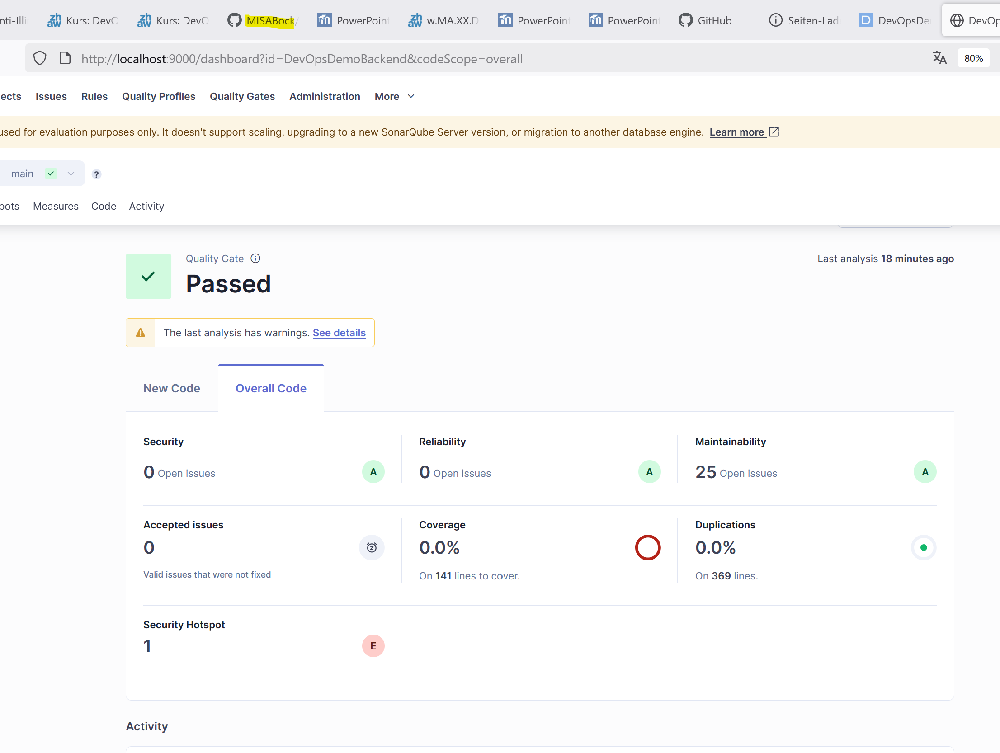
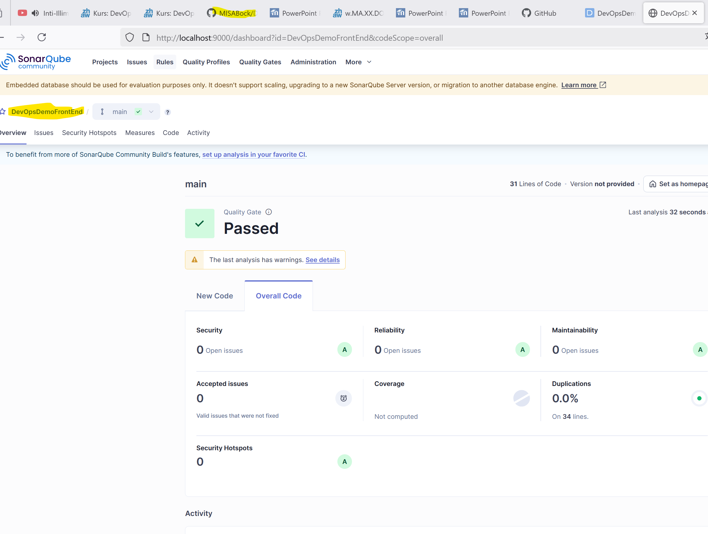

# DevOps 06 Quality

## Lernjournal

als erstes habe ich die Extension "HTMLHint" im Vs Code Installiert. 

In der Datei `index.html` wurde absichtlich ungültiges HTML eingefügt, um das Linting zu testen: ()

Dannach habe ich den Fehler korrigiert. ()

Hier sieht man wie ich den SeleniumTest erfolgreich bestanden habe:  ()

Desweiteren habe ich die Docker Container gestartet in dem ich das docker-compose gestartet habe und localhost 9000 im browser geöffnet. ()

als nächstest habe ich SonarQube-Scan mit Gradle gestartet, der korrekt durchgelaufen ist () 

Dabei scheint alles funktioniert zu haben ()

als letztes habe ich noch das gleiche fürd Frontend gemacht. siehe Bild: ()
