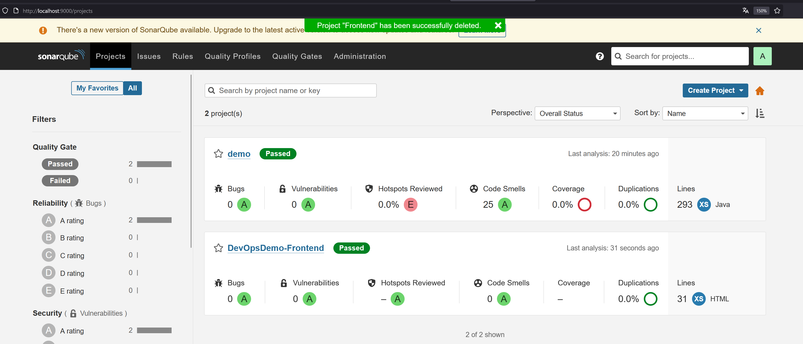

 DevOps 06 Quality

Als ersten habe ich lint installiert und dann npm run lint:html gemacht

nun habe ich absichtlich einen Fehler im HTML-File gemacht, commit & Push und dannachj wieder gefixed, commit & push

Ich habe bereits das Selenium Plugin auf firefox. Ich habe als nächstes die test.side geöffnet und laufen lassen.

Hier noch mit Fehler 

Hier habe ich noch Selenium Grid getestet.

<video controls src="frontend/tests/videos/firefox_30f50d6a-41f2-46ac-b474-9b640949fd62.mp4" title="Title"></video>

Als nächstes habe ich Sonarqube gestartet und beides, Frontend und Backend, analysiert

